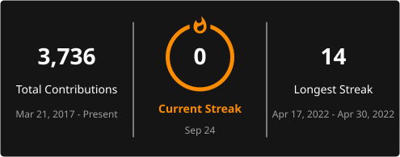

# Hey, I'm Chakshu Jain 👋

Software Engineer, currently plugging away at [NPCI](https://www.npci.org.in/) on the [Digital Rupee](https://www.rbi.org.in/commonman/english/scripts/FAQs.aspx?Id=3686) (e₹) — RBI's central bank digital currency, live in production with 7M+ retail users across India.

I learned Go and Rust the hard way — on the job, under deadline, because the project needed it *yesterday*. Turns out that's still the fastest way to actually learn something.

- 🎤 Talked about Go's Swiss table hash map internals at [GopherCon India 2025](https://www.youtube.com/watch?v=jpaE6-goM1s&t=2087s)
- ☕ Powered by chai, not coffee — sorry, Silicon Valley
- 🌱 Before backend, spent a couple of years building on blockchain technology — different world, same debugging instincts
- 🐛 Currently debugging: life, mostly

---

### Tech I actually reach for

|  |  |  |  |  |  |  |
|:---:|:---:|:---:|:---:|:---:|:---:|:---:|
|  |  |  |  |  |  |  |
|  |  |  |  |  |  |  |

---

